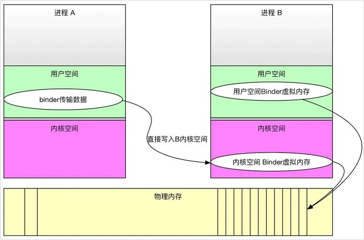

# Android Binder 知识点总结


## 优质文章

[写给 Android 应用工程师的 Binder 原理剖析 - 知乎 👍](https://zhuanlan.zhihu.com/p/35519585)

[彻底理解Android Binder通信架构 - Gityuan博客 | 袁辉辉的技术博客 👍](http://gityuan.com/2016/09/04/binder-start-service/)

[Binder系列—开篇 - Gityuan博客 | 袁辉辉的技术博客 👍](http://gityuan.com/2015/10/31/binder-prepare/)

[Binder机制面试题 - 简书](https://www.jianshu.com/p/4878e9834d1b)

[Android中高级面试题持续助攻：图解Android Binder机制_YoungOne2333的博客-CSDN博客](https://blog.csdn.net/YoungOne2333/article/details/105383128)

## 常见问题


下面是一些常见的问题，可以先尝试的先自我回答一下，点击题目即可查看答案。




* 直观来说，Binder 是 Android 中的一个类，它继承了 IBinder 接口
* 从 IPC 角度来说，Binder 是 Android 中的`一种跨进程通信方式`，Binder 还可以理解为一种虚拟的物理设备，它的设备驱动是/dev/binder，`该通信方式在 linux 中没有`。
* 从 Android Framework 角度来说，Binder 是 ServiceManager 连接各种 Manager（ActivityManager、WindowManager，etc）和相应 ManagerService 的`桥梁`。
* 从 Android 应用层来说，Binder 是`客户端和服务端进行通信的媒介`，当你 bindService 的时候，服务端会返回一个包含了服务端业务调用的 Binder 对象，通过这个 Binder 对象，客户端就可以获取服务端提供的服务或者数据，这里的服务包括普通服务和基于 AIDL 的服务。




性能：移动设备中如果广泛的使用跨进程通信机制肯定会对通信机制提出严格的要求，而 Binder 相比较传统的进程通信方式更加的高效。

安全：由于传统进程通信方式**没有对通信的双方和身方做出严格的验证**，只有上层协议才会去架构，如 socket 连接的 IP 地址可以人为的伪造。
而 Binder 身份校验也是 android 权限模式的基础。




每个Binder的Server进程`会创建很多线程`来处理Binder请求，可以简单的理解为创建了一个Binder的线程池吧（虽然实际上并不完全是这样简单的线程管理方式），而真正管理这些线程并不是由这个Server端来管理的，而是由Binder驱动进行管理的。

一个进程的 Binder 线程数`默认最大是 16`，超过的请求会被`阻塞`等待空闲的 Binder 线程。理解这一点的话，你做进程间通信时处理并发问题就会有一个底。
比如使用 ContentProvider 时（又一个使用 Binder 机制的组件），你就很清楚它的 CRUD（创建、检索、更新和删除）方法只能同时有 16 个线程在跑。




1. 客户端首先获取服务器端的代理对象。所谓的代理对象实际上就是在客户端建立一个服务端的“引用”，该代理对象具有服务端的功能，使其在客户端访问服务端的方法就像访问本地方法一样。
2. 客户端通过调用服务器代理对象的方式向服务器端发送请求。
3. 代理对象将用户请求通过 Binder 驱动发送到服务器进程。
4. 服务器进程处理用户请求，并通过 Binder 驱动返回处理结果给客户端的服务器代理对象。
5. 客户端收到服务端的返回结果。




性能方面：
* 共享内存 0 次数据拷贝
* Binder 1 次数据拷贝
* Socket/管道/消息队列 2 次数据拷贝

稳定性方面：
* Binder：基于 C/S 架构，客户端（Client）有什么需求就丢给服务端（Server）去完成，架构清晰、职责明确又相互独立，自然稳定性更好
* 共享内存：虽然无需拷贝，但是控制复杂，难以使用
* 从稳定性的角度讲，Binder 机制是优于内存共享的。

安全性方面：
* 传统的 IPC 没有任何安全措施，安全依赖上层协议来确保。
* 传统的 IPC 方法无法获得对方可靠的进程用户 ID/进程 UI（UID/PID），从而无法鉴别对方身份。
* 传统的 IPC 只能由用户在数据包中填入 UID/PID，容易被恶意程序利用。
* 传统的 IPC 访问接入点是开放的，无法阻止恶意程序通过猜测接收方地址获得连接。
* Binder 既支持实名 Binder，又支持匿名 Binder，安全性高。




Binder 借助了内存映射的方法，在内核空间和接收方用户空间的数据缓存区之间做了一层内存映射，就相当于直接拷贝到了接收方用户空间的数据缓存区，从而减少了一次数据拷贝。

主要是因为 Linux 是使用的虚拟内存寻址方式，它有如下特性：
* 用户空间的虚拟内存地址是映射到物理内存中的
* 对虚拟内存的读写实际上是对物理内存的读写，这个过程就是内存映射
* 这个内存映射过程是通过系统调用 mmap()来实现的




Binder 驱动
* 在内核空间创建一块接收缓存区，
* 实现地址映射：将内核缓存区、接收进程用户空间映射到同一接收缓存区
发送进程通过系统调用（copy_from_user）将数据发送到内核缓存区。
由于内核缓存区和接收进程用户空间存在映射关系，故相当于也发送了接收进程的用户空间，实现了跨进程通信。




序列化，表示将一个对象转换成可存储或可传输的状态。序列化的原因基本三种情况：
* 永久性保存对象，保存对象的字节序列到本地文件中；
* 对象在网络中传递；
* 对象在IPC间传递。




Intent 携带信息的大小其实是受 Binder 限制。
数据以 Parcel 对象的形式存放在 Binder 传递缓存中。
如果数据或返回值比传递 buffer 大，则此次传递调用失败并抛出 TransactionTooLargeException 异常。

Binder 传递缓存有一个限定大小，通常是 `1Mb`。
但同一个进程中所有的传输共享缓存空间。
多个地方在进行传输时，即时它们各自传输的数据不超出大小限制，TransactionTooLargeException 异常也可能会被抛出。
在使用 Intent 传递数据时，`1Mb 并不是安全上限`。因为 Binder 中可能正在处理其它的传输工作。不同的机型和系统版本，这个上限值也可能会不同。

```c++
// Binder本身就是为了进程间频繁而灵活的通信所设计的，并不是为了拷贝大数据而使用的
#define BINDER_VM_SIZE ((1*1024*1024) - (4096 *2))
```




Binder IPC 正是基于内存映射（mmap）来实现的，但是 mmap() 通常是用在有物理介质的文件系统上的。

比如进程中的用户区域是不能直接和物理设备打交道的，如果想要把磁盘上的数据读取到进程的用户区域，需要两次拷贝（磁盘–>内核空间–>用户空间）；

通常在这种场景下 mmap() 就能发挥作用，通过在物理介质和用户空间之间建立映射，减少数据的拷贝次数，用内存读写取代 I/O 读写，提高文件读取效率。

而 Binder 并`不存在物理介质`，因此 Binder 驱动使用 mmap() 并不是为了在物理介质和用户空间之间建立映射，而是用来`在内核空间创建数据接收的缓存空间`。

一次完整的 Binder IPC 通信过程通常是这样：

* 首先 Binder 驱动在内核空间创建一个数据接收缓存区；
* 接着在内核空间开辟一块内核缓存区，建立内核缓存区和内核中数据接收缓存区之间的映射关系，以及内核中数据接收缓存区和接收进程用户空间地址的映射关系；
* 发送方进程通过系统调用 copyfromuser() 将数据 copy 到内核中的内核缓存区，由于内核缓存区和接收进程的用户空间存在内存映射，因此也就相当于把数据发送到了接收进程的用户空间，这样便完成了一次进程间的通信。




相比其他的IPC通信，比如消息机制、共享内存、管道、信号量等，Binder`仅需一次内存拷贝`，即可让目标进程读取到更新数据，同共享内存一样相当高效，其他的IPC通信机制大多需要2次内存拷贝。

Binder内存拷贝的原理为：A为Binder客户端，在IPC调用前，需将其用户空间的数据拷贝到Binder驱动的内核空间，由于进程B在打开Binder设备(/dev/binder)时，已将Binder驱动的内核空间映射(mmap)到自己的进程空间，所以进程B可以直接看到Binder驱动内核空间的内容改动。



## 复习图片




## 视频资料



