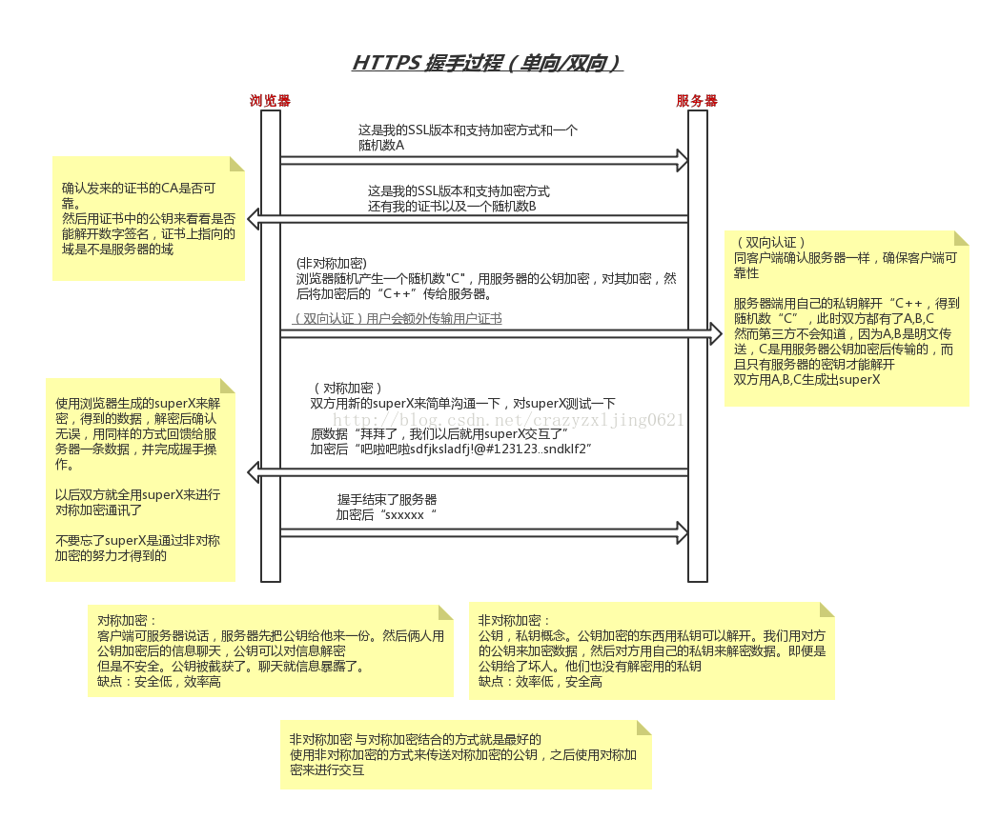

## 说明

以下内容来自[9月Android面试经验分享.md - 简书](https://www.jianshu.com/p/a1cb87be4a88)摘要。


查看答案前可先自我尝试回答一下，用于增强自己的对问题的理解。



## 一面






#### 优质博文

[HTTPS中SSL/TLS握手时的私钥用途（RSA、ECDHE） - xdyixia - 博客园 👍](https://www.cnblogs.com/xdyixia/p/11642480.html)

[HTTPS握手过程与对称加密、非对称加密_曾经沧海难为水的博客-CSDN博客](https://blog.csdn.net/crazyzxljing0621/article/details/78042285)

#### 视频资料







只有在一种情况下，这样做是可行的：

在try语句中声明了`很大的对象，导致OOM`，并且可以确认OOM是由try语句中的对象声明导致的，那么在catch语句中，可以释放掉这些对象，解决OOM的问题，继续执行剩余语句。

[征服Android面试官路漫漫（二）：OutOfMemoryError 可以被 try catch 吗 ？](https://blog.csdn.net/weixin_44339238/article/details/109457126)

[catch 住 OOM，行吗？_内存](https://www.sohu.com/a/340380966_611601)





公钥和私钥就是俗称的不对称加密方式。

公钥（Public Key）与私钥（Private Key）是通过一种算法得到的`一个密钥对`（即一个公钥和一个私钥），`公钥是密钥对中公开的部分`，`私钥则是非公开的部分`。

公钥通常用于加密会话密钥、验证数字签名，或加密可以用相应的私钥解密的数据。

[什么是公钥和私钥？_SSL证书管理 SCM_常见问题_咨询类_华为云](https://support.huaweicloud.com/scm_faq/scm_01_0045.html)




正常来说不建议客户端保持私钥，私钥一般放在服务器中保存，客户端保存公钥。

如果非要在客户端保存私钥内容，一般建议的做法有：
1. 客户端存储一套公钥，经过服务器端私钥加密需要保存的私钥进行网络传输（可能会被截取）
2. 客户端解密后立即使用生物密码(如指纹信息)进行加密保存

以上内容都可以被HOOK技术截获。

[显示生物识别身份验证对话框  |  Android 开发者  |  Android Developers](https://developer.android.com/training/sign-in/biometric-auth?hl=zh-cn)




#### 比例大小压缩

通过设置`BitmapFactory.Options`中`inSampleSize`的值就可以实现。

比如我们有一张20481536像素的图片，将inSampleSize的值设置为4，就可以把这张图片压缩成512384像素。原本加载这张图片需要占用13M的内存，压缩后就只需要占用0.75M了(假设图片是ARGB_8888类型，即每个像素点占用4个字节)。

#### 质量压缩

根据传递进去的质量大小，采用系统自带的压缩算法，将图片压缩成JPEG格式

#### 图片压缩库进行压缩

如：使用`JNI使用Jpeg库`或者[Curzibn/Luban](https://github.com/Curzibn/Luban)库进行图片压缩，或使用[bumptech/glide](https://github.com/bumptech/glide)等三方库进行加载。

#### 加载长图

可以使用`BitmapRegionDecoder`只渲染一个图片的局部，而非全部加载一个图片

[Android加载大图长图方案简析 - 简书 👍](https://www.jianshu.com/p/f2a0d36f0f08)





说实话我不知道这题是在问什么，是在问`am start activity中间计时的原理？`还在在问`从Application类被加载，开始记时间戳一直到第一个activity加载的时间？`

[应用启动时间  |  Android 开发者  |  Android Developers](https://developer.android.com/topic/performance/vitals/launch-time?hl=zh-cn)

[如何统计Android App启动时间 - 简书](https://www.jianshu.com/p/59a2ca7df681)

[怎么计算apk的启动时间？ - 知乎 👍](https://www.zhihu.com/question/35487841/answer/63011462)





#### Error错误

Error类以及他的子类的实例，代表了JVM本身的错误。错误不能被程序员通过代码处理，Error很少出现。因此，程序员应该关注Exception为父类的分支下的各种异常类。

#### Exception异常

Exception以及他的子类，代表程序运行时发送的各种不期望发生的事件。可以被Java异常处理机制使用，是异常处理的核心。

1. 检查异常：编译时没有处理的异常会编译失败。
2. 非检查异常：`Error`和`RuntimeException` 以及他们的`子类`，在编译时不检查。

#### OutOfMemoryError

属于Error级别的；

```java
public class OutOfMemoryError extends VirtualMachineError {
    private static final long serialVersionUID = 8228564086184010517L;

    public OutOfMemoryError() {
        super();
    }
    public OutOfMemoryError(String s) {
        super(s);
    }
}
```

[Java异常的分类有哪些以及OOM解决方案？_jike11231的博客-CSDN博客](https://blog.csdn.net/jike11231/article/details/117248361)





这个问题可长可短，可以从链路复用讲起，目前主要问的是`QUIC`协议的相关的内容。

[Android 网络性能优化（4）弱网优化_RikkaTheWorld-CSDN博客_android弱网优化](https://blog.csdn.net/rikkatheworld/article/details/109050268)

[百度App网络深度优化系列（三）：弱网优化-InfoQ](https://www.infoq.cn/article/pqmluecekw*dsymqbgvy)

[深入探索 Android 网络优化（三、网络优化篇）下 - 掘金](https://juejin.cn/post/6844904186333642766)



## 二面













参考Glide回答就行了




一些细节追问：什么时候链表转树？为啥要转成树？什么时候树再次转回链表







